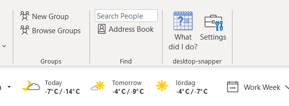
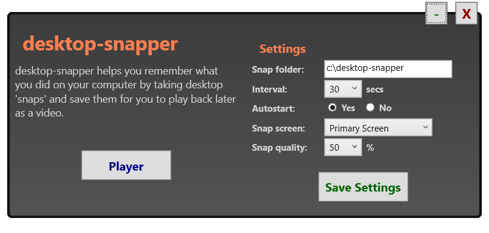
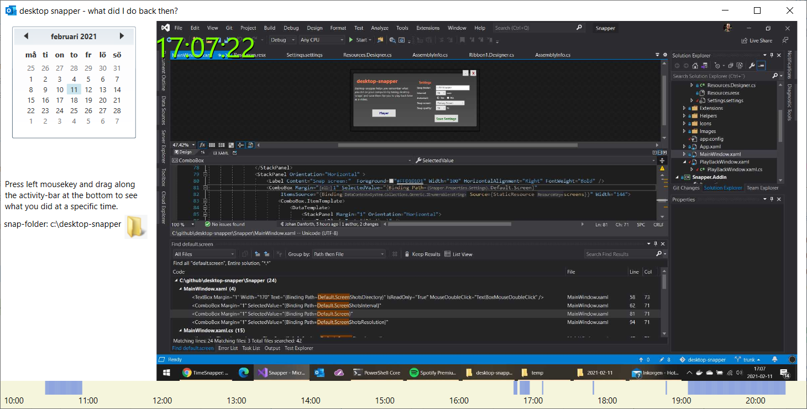

# desktop-snapper

Desktop-snapper records your screen as you work. It is both a stand-alone program, but primarily an addin to 
Microsoft Outlook.

**Features:**

- uses system hook to detect if you actually was active or not
- autostarted
- integrates into Outlook (optionally)
- go back in time and see what you did 
- instant replay (planned)

You control how often "snaps" of your desktop is taken, the quality of them, and where they
should be stored. Just remember to cleanout the image directory now and then.

Snapped images can be viewed and "played back".

The code is built with c# and the .NetFramework 4.7.2.

**Using**

If the addin is installed, the program opens up when Outlook is started.
The taskbar buttons are visible only in the Calendar view:

First time the addin is started, the settings dialog shows:

The "player" allows you to select a date and "play back" the snaps taken that day.
The "action bar" at the bottom displays blue areas where you were active and
screenshots were taken:

